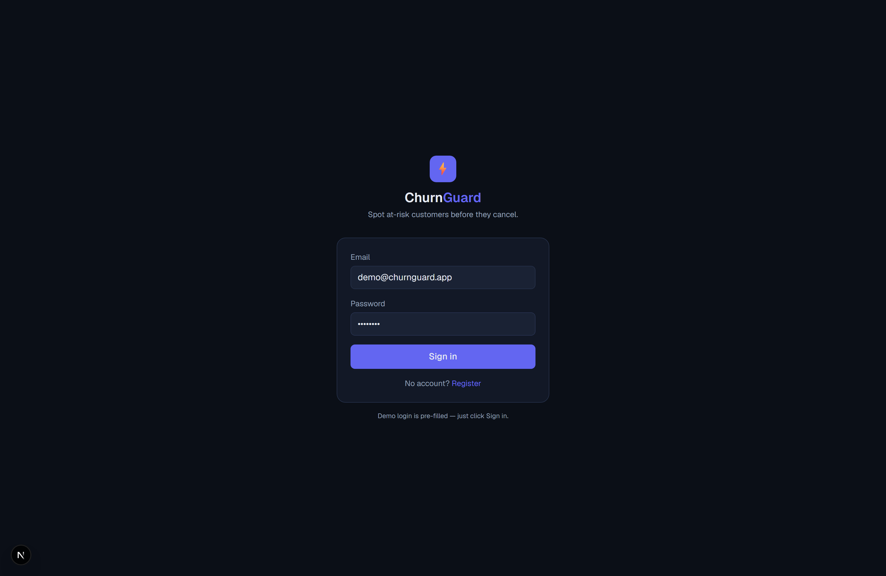
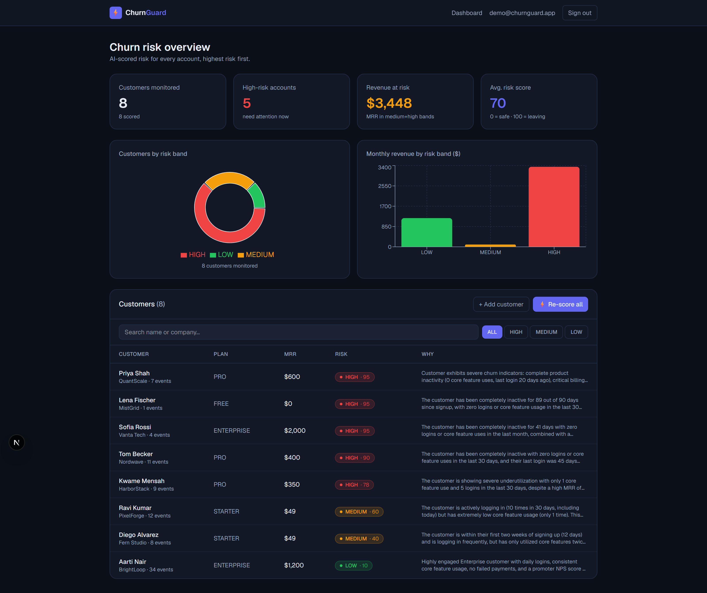
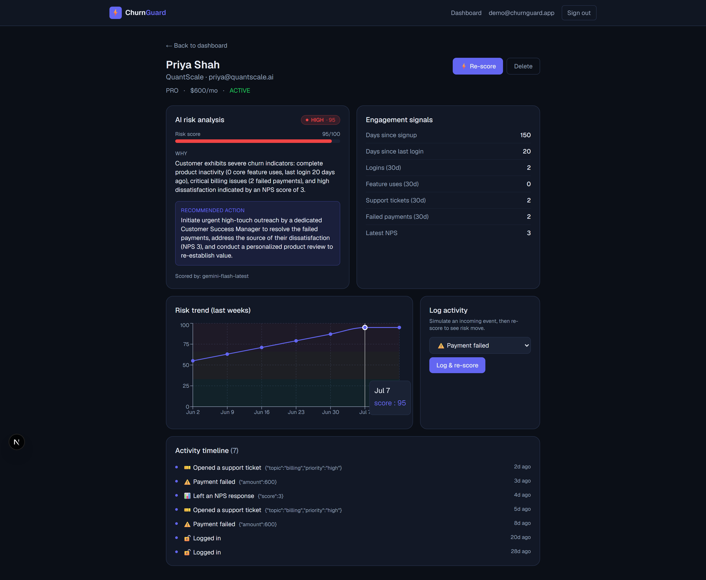
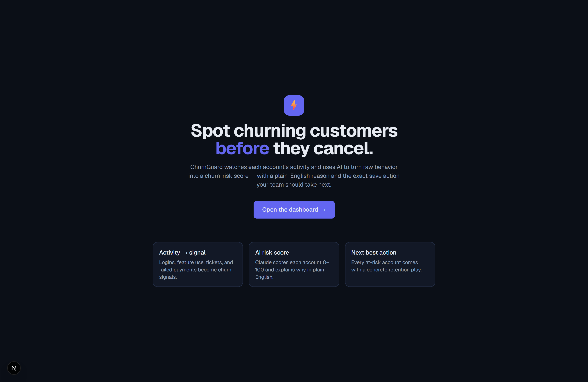

<div align="center">

# ⚡ ChurnGuard

### AI Churn-Risk Dashboard for SaaS

*Spot churning customers **before** they cancel. ChurnGuard turns each account's raw behavior into an explainable **0–100 churn-risk score**, a plain-English reason, and the exact save action your team should take next.*

<br/>

[](https://nextjs.org/)
[](https://react.dev/)
[](https://www.typescriptlang.org/)
[](https://tailwindcss.com/)
[](https://www.postgresql.org/)
[](https://www.prisma.io/)
[](https://recharts.org/)
[](https://www.anthropic.com/)

[](LICENSE)


</div>

---

## 📖 Overview

**The problem:** SaaS companies usually find out a customer is leaving only when
they cancel — by then it's too late to save them.

**The solution:** **ChurnGuard** watches each account's activity — logins, feature
use, support tickets, failed payments, NPS — and turns that raw behavior into a
**churn-risk score (0–100)** with a **plain-English reason** and a **recommended
save action**, so the customer-success team can act *before* the customer churns.

The design principle is that **churn risk should be explainable, not a mystery**:

- ⚙️ **Deterministic feature extraction** distills the raw event stream into a
  handful of churn signals, and **fixed band thresholds** (`≥66 HIGH`, `≥33 MEDIUM`)
  decide the band — so the same input always lands in the same band.
- 🤖 **The LLM supplies judgment**, via a **tool-use call** that *forces* a
  structured `{ score, band, reason, action }` response — no fragile JSON parsing —
  and falls back to a transparent rule-based heuristic when no API key is set, so
  the app **always works end-to-end**.

> **The one-liner:** a Next.js 16 App-Router app where server route handlers turn
> activity events into deterministic churn features, ask Claude (via tool use) to
> score and explain the risk, snapshot every re-score for a trend chart, and render
> it all in a dark-glass customer-success console.

<div align="center">

**🔑 Demo login** &nbsp;·&nbsp; `demo@churnguard.app` &nbsp;/&nbsp; `demo1234` &nbsp;·&nbsp; *(pre-filled — just click Sign in)*

</div>

---

## 📸 Screenshots

### Landing — *spot churning customers before they cancel*

<div align="center">
  
</div>

### Dashboard — *the whole book of business, highest risk first*
> Four KPI cards (customers monitored, high-risk accounts, revenue at risk, average risk), a risk-band donut, a revenue-by-band bar chart, and a searchable, band-filterable customer table with the AI's reason for each score.

<div align="center">
  
</div>

<table>
  <tr>
    <td width="50%">
      <b>👤 Customer Detail</b><br/>
      <sub>AI risk analysis + recommended action, engagement signals, a risk-over-time trend, and a live "log an event → re-score" loop.</sub><br/><br/>
      
    </td>
    <td width="50%">
      <b>🔐 Authentication</b><br/>
      <sub>Email/password login (bcrypt) via NextAuth with JWT sessions; the demo operator is pre-filled.</sub><br/><br/>
      
    </td>
  </tr>
</table>

---

## ✨ Features

| Area | What it does |
|------|--------------|
| 🔐 **Auth** | Email/password login (bcrypt) via next-auth with JWT sessions. Every protected page & API route requires a valid session. |
| 📊 **Dashboard** | Headline KPIs — customers monitored, high-risk accounts, revenue at risk, average risk — plus a risk-band donut and a revenue-by-band bar chart. |
| 🧠 **AI risk scoring** | Claude scores each account 0–100 and explains *why*, with a concrete next-best-action — via a **tool-use** call for guaranteed structure. Falls back to a heuristic with no key. |
| 📈 **Risk trend over time** | Every re-score is snapshotted, so each customer shows a risk-over-time line chart with band shading. |
| 📡 **Live activity ingestion** | `POST /api/customers/:id/events` is the real ingestion path; the UI logs an event and re-scores so you can watch risk move in real time. |
| 🔎 **Search & filter** | Search by name/company and filter the table by risk band. |
| 👤 **Customer detail** | Engagement signals, a full risk breakdown, and a complete activity timeline. |
| ✍️ **CRUD** | Add, edit, re-score and remove monitored customers. |

---

## 🧠 How the AI scoring works *(the interesting part)*

1. **Feature extraction** (`src/lib/scoring.ts`) turns a customer's raw event stream into churn signals: days since last login, logins in the last 30 days, feature uses, failed payments, support-ticket volume, latest NPS, MRR, plan.
2. Those features are sent to Claude via a **tool-use call** (`report_churn_risk`) that *forces* a structured `{ score, band, reason, action }` response — **no fragile JSON parsing**.
3. Fixed thresholds set the band deterministically: **`≥66 → HIGH`**, **`≥33 → MEDIUM`**, else **`LOW`**.
4. If `ANTHROPIC_API_KEY` is missing (it tries Gemini next), a **rule-based heuristic** produces the same shape — so the product degrades gracefully.

> This split — **deterministic feature extraction + LLM judgment** — keeps the scoring explainable, which matters both for users and in interviews.

> 📐 The full activity-to-verdict walkthrough lives in **[`docs/ARCHITECTURE.md`](docs/ARCHITECTURE.md)**.

---

## 🛠️ Tech Stack

| Layer | Technology |
|-------|-----------|
| **Framework** | Next.js 16 (App Router, Server Components) |
| **UI** | React 19 · Tailwind CSS 4 · Recharts |
| **Language** | TypeScript 5 |
| **Database** | PostgreSQL |
| **ORM** | Prisma 6 |
| **Auth** | next-auth (credentials, JWT) + bcryptjs |
| **AI** | Anthropic Claude (`@anthropic-ai/sdk`, **tool use**) · Google Gemini (optional) · heuristic fallback |

---

## 🚀 Getting Started

### Prerequisites
- **Node.js** 18.18+ (20+ recommended)
- **PostgreSQL** 14+ running locally (or a hosted connection string)

### Installation

```bash
# 1. Clone the repository
git clone https://github.com/bhanu87777/ChurnGuard.git
cd ChurnGuard

# 2. Install dependencies
npm install

# 3. Configure environment
cp .env.example .env
#   → set DATABASE_URL, generate AUTH_SECRET (openssl rand -base64 32),
#     and optionally add ANTHROPIC_API_KEY or GEMINI_API_KEY

# 4. Create tables, seed demo data, and compute initial scores
npx prisma migrate dev
npm run db:seed          # demo operator + customers + event streams
npm run db:score         # compute initial risk scores

# 5. Run the dev server
npm run dev              # → http://localhost:3000
```

Then sign in with the demo account: **`demo@churnguard.app` / `demo1234`**.

---

## 📋 Usage

| Command | Description |
|---------|-------------|
| `npm run dev` | Start the development server |
| `npm run build` | Production build |
| `npm run start` | Serve the production build |
| `npm run lint` | Run ESLint |
| `npm run db:seed` | Seed the demo operator, customers and activity events |
| `npm run db:score` | Compute (or recompute) risk scores for every customer |
| `npx prisma migrate dev` | Apply migrations to the database |
| `npx prisma studio` | Browse the data in Prisma Studio |

**Watch risk move live:** open any customer, use **Log activity** to simulate an
incoming event (e.g. *Payment failed*), then **Log & re-score** — the score, band
and trend line update in place.

---

## 📁 Project Structure

```
ChurnGuard/
├── assets/
│   └── screenshots/          # README imagery
├── docs/
│   ├── ARCHITECTURE.md       # activity → verdict walkthrough
│   ├── ChurnGuard_1_Features_Walkthrough.pdf
│   └── ChurnGuard_2_Codebase_Guide.pdf
├── prisma/
│   ├── schema.prisma         # User, Customer, ActivityEvent, RiskScore(+History)
│   ├── seed.ts               # demo operator + customers + event streams
│   └── score-all.ts          # compute initial risk scores
├── src/
│   ├── app/
│   │   ├── api/              # customers, events, score, score-all, auth, register
│   │   ├── dashboard/        # churn-risk overview
│   │   ├── customers/[id]/   # customer detail + live re-score loop
│   │   ├── login/ · page.tsx # auth + landing
│   │   └── layout.tsx
│   ├── components/           # dashboard/ · customer/ · RiskBadge · Navbar
│   └── lib/                  # scoring · score-service · auth · prisma · utils
├── .env.example
├── LICENSE
└── package.json
```

> `src/lib/` is the hub every part routes through — nothing touches the database
> or the AI except code in `lib`.

---

## 🔭 Future Improvements

- [ ] **Authenticated ingestion** — per-tenant API keys so real product events can stream into `/events`
- [ ] **Alerting** — Slack / email when an account crosses into **HIGH** risk
- [ ] **Cohort analytics** — churn rate by plan and by signup month
- [ ] **Bulk import** — CSV / webhook onboarding of existing customers
- [ ] **Configurable thresholds** — per-workspace band cutoffs and signal weights
- [ ] **Playbooks** — turn each recommended action into a trackable task
- [ ] **Test suite** — unit tests for `scoring.ts` feature extraction + band logic

---

## 🤝 Contributing

Contributions, issues, and feature requests are welcome!

1. Fork the project
2. Create your feature branch (`git checkout -b feature/amazing-feature`)
3. Commit your changes (`git commit -m 'Add amazing feature'`)
4. Push to the branch (`git push origin feature/amazing-feature`)
5. Open a Pull Request

Please run `npm run lint` before submitting.

---

## 📄 License

Distributed under the **MIT License**. See [`LICENSE`](LICENSE) for details.

---

## 👤 Author

**Bhanu Prakash M**

[](https://github.com/bhanu87777)

> 💡 If ChurnGuard helped or impressed you, consider giving the repo a ⭐ — it genuinely helps!

<div align="center">
<sub>Built as a portfolio project to demonstrate full-stack development with explainable AI integration.</sub>
</div>
